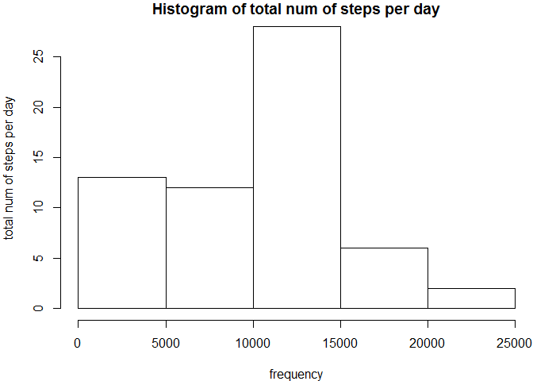
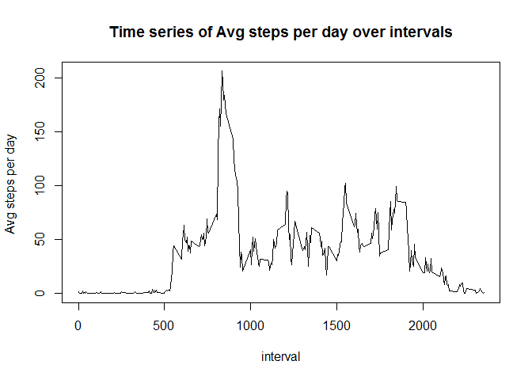
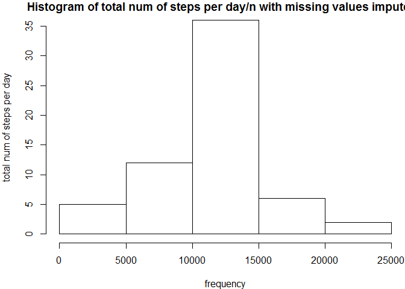
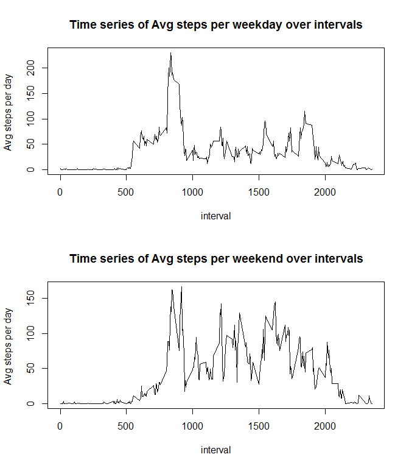

# Reproducible Research: Peer Assessment 1


## Loading and preprocessing the data


```r
                #loading the data
data<-read.csv("activity.csv")
```

## What is mean total number of steps taken per day?

```r
                #loading dplyr as needed
library("dplyr")
```

```
## 
## Attaching package: 'dplyr'
## 
## The following object is masked from 'package:stats':
## 
##     filter
## 
## The following objects are masked from 'package:base':
## 
##     intersect, setdiff, setequal, union
```

```r
                #summerising the data by date and finding the sum  
data_sum<-summarise(group_by(data,date),sum(steps,na.rm=TRUE))
data_sum<-data.frame(data_sum)
names(data_sum)<-c("date","steps")
                
                #plotting the histogram
par(mar=(c(4,4,1,0)))
hist(data_sum$steps,main="Histogram of total num of steps per day",xlab="frequency",ylab="total num of steps per day")
```

 

```r
                #calculating the mean and median
me<-mean(data_sum$steps)
med<-median(data_sum$steps)
```

#### The mean of the total number of steps per day is  9354.2295082  and median is  10395 

## What is the average daily activity pattern?

```r
                  #summersing the data by interval and finding mean
data_mean<-summarise(group_by(data,interval),mean(steps,na.rm=TRUE))
data_mean<-data.frame(data_mean)
names(data_mean)<-c("interval","steps")

                  #plotting the time series 
with(data_mean,plot(interval,steps,type="l",ylab="Avg steps per day ",main="Time series of Avg steps per day over intervals"))
```

 

```r
                  #finding the interval with the maximum avg steps
max_index<-which.max(data_mean$steps)
max_steps<-data_mean$steps[max_index]
max_interval<-data_mean$interval[max_index]
```
#### The interval with maiximum steps averaged over all days is  835  with  206.1698113  number of steps

## Imputing missing values


```r
                #counting the number of rows with NA's
count<-sum(!complete.cases(data))

                #replacing the NA's with the mean steps for that 
                #interval overall days
data_hist<-mapply(function(x,y){
    if(is.na(y)){y<-data_mean$steps[data_mean$interval==x]}
    y
},data$interval,data$steps)
new_frame<-data.frame(data$date,data_hist)
names(new_frame)<-c("date","steps")
data1<-new_frame

                 #again summarising by date and finding sum of steps
data_sum1<-summarise(group_by(data1,date),sum(steps))
data_sum1<-data.frame(data_sum1)
names(data_sum1)<-c("date","steps")

                #again  drawing the hist 
par(mar=(c(4,4,1,0)))
hist(data_sum1$steps,main="Histogram of total num of steps per day/n with missing values imputed  ",xlab="frequency",ylab="total num of steps per day")
```

 

```r
                #again  calculating the mean and median
me<-mean(data_sum1$steps)
med<-median(data_sum1$steps)
```
#### total number of missing values in the dataset 2304


####After imputing the missing values the mean of the total number of steps per day is  1.0766189\times 10^{4}  and median is  1.0766189\times 10^{4} 

**DIFFERENCE BETWEEN THE TWO HISTOGRAMS** : Because i have imputed the missing values in the *steps* variable by the mean of the *steps*'s values in that interval over all the days, so the frequency of the values that lies near to the mean of *steps* variable increases, decreasing the variance and increasing the height of the central peak of the new histogram 


## Are there differences in activity patterns between weekdays and weekends?

```r
                     #loading lubridate
library("lubridate")

                    #parsing the date and creating a logical vector
                    #depending upon the date is weekend or not
 a<-weekdays(ymd(data$date)) %in% c("Sunday","Saturday")

                    #creating the desired factor variable of weekend and weekday
fac<-vector("character",length=length(a))
fac[a]<-"weekend"
fac[!a]<-"weekday"
fac<-factor(fac)
data2<-data.frame(data,fac,data_hist)

                   #summarising the data by interval and the factor variable
data_mean1<-summarise(group_by(data2,interval,fac),mean(data_hist))
data_mean1<-data.frame(data_mean1)
names(data_mean1)<-c("interval","fac","steps")

                   #subsetting the data based on the factor
sub1<-subset(data_mean1,fac=="weekday")
sub2<-subset(data_mean1,fac=="weekend")
                  #plotting the two time series
par(mfrow=c(2,1))

with(sub1,plot(interval,steps,type="l",ylab="Avg steps per day ",main="Time series of Avg steps per weekday over intervals"))

with(sub2,plot(interval,steps,type="l",ylab="Avg steps per day ",main="Time series of Avg steps per weekend over intervals"))
```

 
